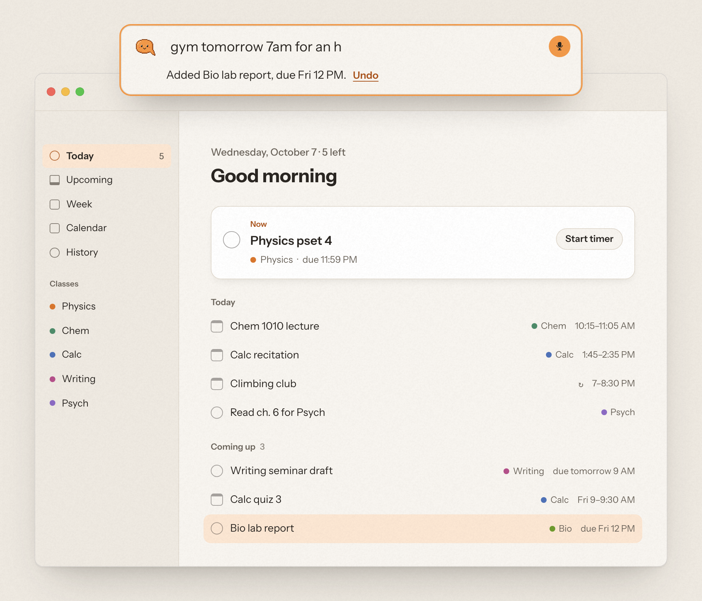
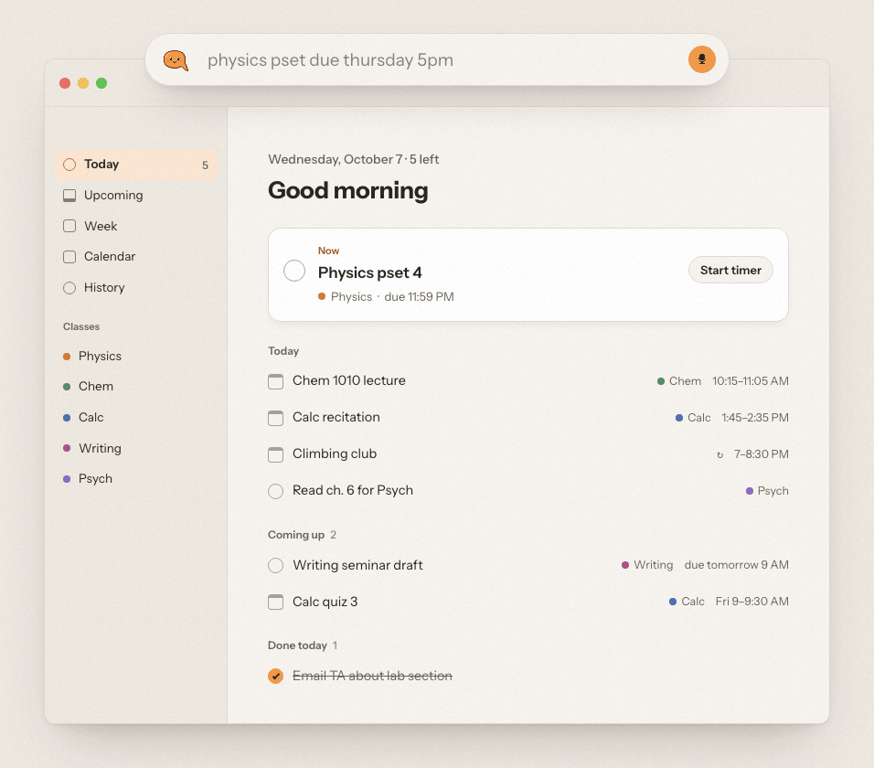

<div align="center">


# Cue

**The planner you talk to.**<br>
Press <kbd>⌥</kbd> <kbd>Space</kbd>, say what's on your plate, and Cue puts it on your day.

<a href="https://github.com/ysta32/cue-releases/releases/latest/download/Cue-mac.zip"></a>

<sub>Free · macOS 15 or later · <a href="https://github.com/ysta32/cue-releases/releases/latest">v1.0.0 release notes</a> · <a href="https://cue-planner.vercel.app">cue-planner.vercel.app</a></sub>

<br><br>



</div>

<br>

## Say it like you'd text a friend

College runs on a thousand small deadlines. Cue lets you catch each one in about two seconds,
from anywhere on your Mac, without opening an app or filling out a form.

| You say | Cue does |
| --- | --- |
| *"physics pset due thursday at 5"* | Adds **Physics pset**, due Thu 5:00 PM |
| *"gym tomorrow 7am for an hour"* | Blocks 7:00–8:00 AM tomorrow |
| *"move the lab report to monday"* | Moves it, and shows you the change first |
| *"when can I hit the gym this week?"* | Finds the gaps between your classes and answers |
| *"what's due tomorrow?"* | Tells you, out loud if you asked out loud |
| *"done with the reading"* | Checks it off |

Most requests are understood on the spot by Cue's own parser. The rare tricky one takes about a second.

## See it in action

<div align="center">

<br>
<sub>Try it yourself, no download needed, at <a href="https://cue-planner.vercel.app/#demo">cue-planner.vercel.app</a>.</sub>
</div>

## Meet Q

Q lives in your capture bar and your menu bar. It listens, thinks, and tells you when it's done.

<div align="center">
<table>
<tr>
<td align="center"><br><sub>ready</sub></td>
<td align="center"><br><sub>listening</sub></td>
<td align="center"><br><sub>thinking</sub></td>
<td align="center"><br><sub>done</sub></td>
<td align="center"><br><sub>late night</sub></td>
</tr>
</table>
</div>

## Everything in one place

<table>
<tr>
<td width="50%" valign="top">

**⌥Space, from anywhere**<br>
A floating capture bar over whatever you're doing. Type or talk. On Apple silicon, an on-device
Whisper model double-checks what you said.

**Ask Q**<br>
"Am I free at 3?" "What's at risk this week?" Q checks your calendar and tasks and gives you a
straight answer.

**Your calendars, both ways**<br>
Google Calendar and Apple Calendar events come in. Adds, edits and deletes go back out automatically.

**Canvas and syllabi**<br>
Paste your Canvas calendar feed, or drop in a syllabus, and every deadline lands on your day.

</td>
<td width="50%" valign="top">

**Today, Week, Month**<br>
A calm Today view, drag-to-reschedule on the week, and a workload heatmap on the month that
warns you before a crunch.

**Focus and wrap-up**<br>
Pomodoro cycles on any task, an evening wrap-up that clears the decks, and a weekly review.

**Keyboard-first**<br>
⌘K command palette, arrow-key navigation, and a menu bar Q with what's next.

**The small things**<br>
Recurring tasks, snooze, subtasks, reminders, links and files on tasks, class schedules, and
agenda export.

</td>
</tr>
</table>

## Install

1. **[Download Cue-mac.zip](https://github.com/ysta32/cue-releases/releases/latest/download/Cue-mac.zip)** and double-click it to unzip.
2. Drag **Cue** into your **Applications** folder.
3. Open Cue. macOS will say it can't verify the developer. Click **Done**.
4. Open **System Settings → Privacy & Security**, scroll down, and click **Open Anyway** next to Cue. Confirm with your password.
5. Cue opens. Type your first name to create your account, then press <kbd>⌥</kbd> <kbd>Space</kbd> and start talking.

<details>
<summary><b>Why the extra step?</b></summary>

<br>

Cue 1.0 isn't notarized by Apple yet, so macOS asks you to approve it once. You only do this
the first time. Notarization is planned for a future release.

To check that your download is the one we published, compare its checksum with the
`.sha256` file attached to the release:

```sh
shasum -a 256 ~/Downloads/Cue-1.0.0-mac.zip
```

</details>

## Privacy

Your tasks sync to your Cue account so they're there when you come back. Speech is turned
into text by Apple's on-device recognition when your Mac supports it, and your audio never
reaches Cue, only the text. When Cue's own parser can't work out a request, that text goes
to a language model to help understand it. We don't sell data or show ads. Deleting your account in
**Settings → Account** erases everything. Read the full [Privacy Policy](PRIVACY.md).

## FAQ

<details>
<summary><b>Is Cue really free?</b></summary>
<br>
Yes. No trial, no credit card. Fair-use limits keep the hosted service free for everyone.
</details>

<details>
<summary><b>Is there an iPhone app?</b></summary>
<br>
Not yet. Cue is a Mac app today.
</details>

<details>
<summary><b>Does it work offline?</b></summary>
<br>
You can see and edit your day offline. New captures wait and sync when you're back online.
</details>

<details>
<summary><b>Which Macs are supported?</b></summary>
<br>
Any Mac running macOS 15 Sequoia or later, including macOS 26 Tahoe.
</details>

<details>
<summary><b>How do I update?</b></summary>
<br>
Cue checks for new versions once a day and tells you in Settings. You can also choose
<b>Cue → Check for Updates…</b>, then download the new zip and replace the app.
</details>

<details>
<summary><b>Where's the source code?</b></summary>
<br>
Cue is free to use but not open source. This repository hosts releases, release notes and the issue tracker.
</details>

## Help and feedback

Found a bug or have an idea? [Open an issue](https://github.com/ysta32/cue-releases/issues/new/choose).
Inside the app, **Help → Send Feedback** works too.

<br>

<div align="center">

<br>
<sub>Made for students who'd rather be doing literally anything else.<br>
© 2026 Cue · <a href="LICENSE.md">License</a> · <a href="PRIVACY.md">Privacy</a> · <a href="CHANGELOG.md">Changelog</a></sub>
</div>
